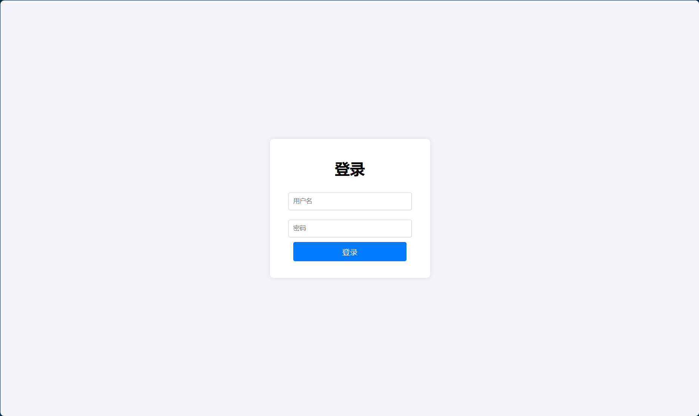
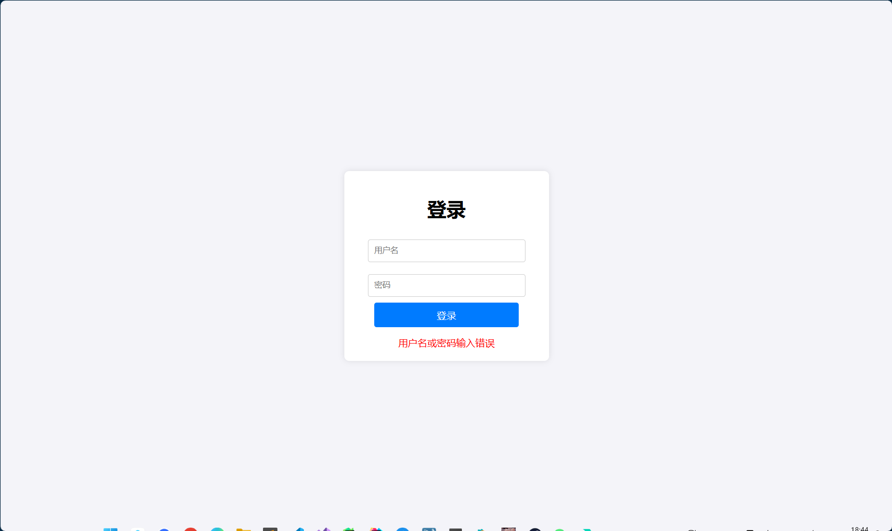
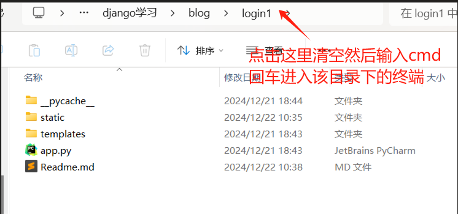
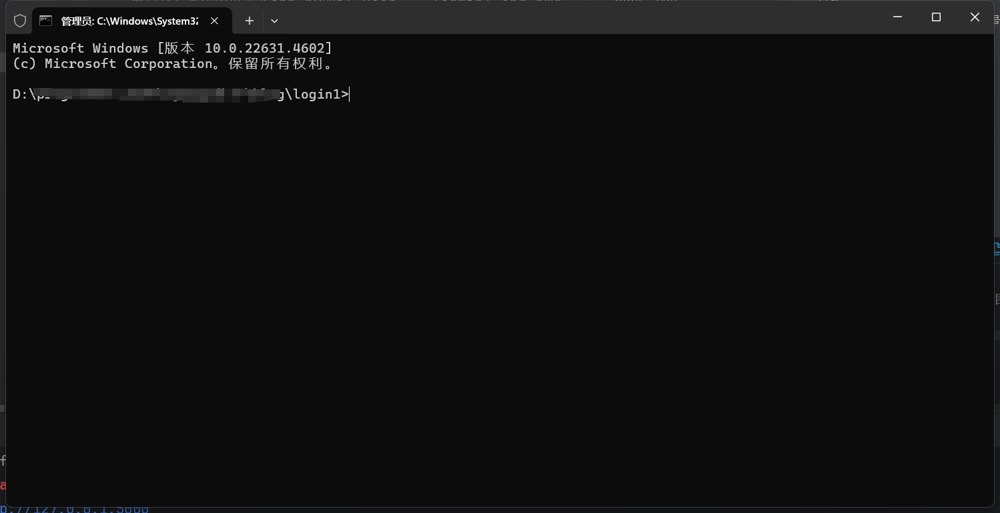

### _项目预览_



<p align="left">
    <a href=''>
      
    </a>
    <a href=''>
      
    </a>
</p>
### _思路_
在项目根目录下创建templates文件夹来存放用于浏览器渲染的html文件，并在其中创建signin.html作为登录页面，访问本地5000端口/signin时渲染，登录成功就渲染hello.html，失败就返回登录错误信息并回到signin.html重新登录。
### _具体做法_
采用python的轻量级web框架flask，在app.py里写装饰器@app.route('/signin', methods=['GET', "POST"])用于调用函数login()进行登录页面的渲染和登录操作，当登陆成功就return render_template('hello.html', greeting=f"您好！{user}")渲染欢迎用户的页面
### _用户设置_
用户名与密码的更改在app.py的if user == 'admin' and pwd == '123':字段中，对于html的编写参考ai生成的代码，丰富了页面的样式，提高美观性~~可以作为加分项~~
### _总结_
总结：通过此项目，我初步学习框架flask，了解html，css，JavaScript，前端三大件，也学会借力ai辅助开发。
### _运行代码_
进入项目根目录，运行以下命令


在上面的黑色终端窗口输入一下代码
```python
flask run # 运行项目(到项目根目录启动终端)
```
访问：[http://127.0.0.1:5000/signin](http://127.0.0.1:5000/signin)

---
> 人生苦短，我用python！
